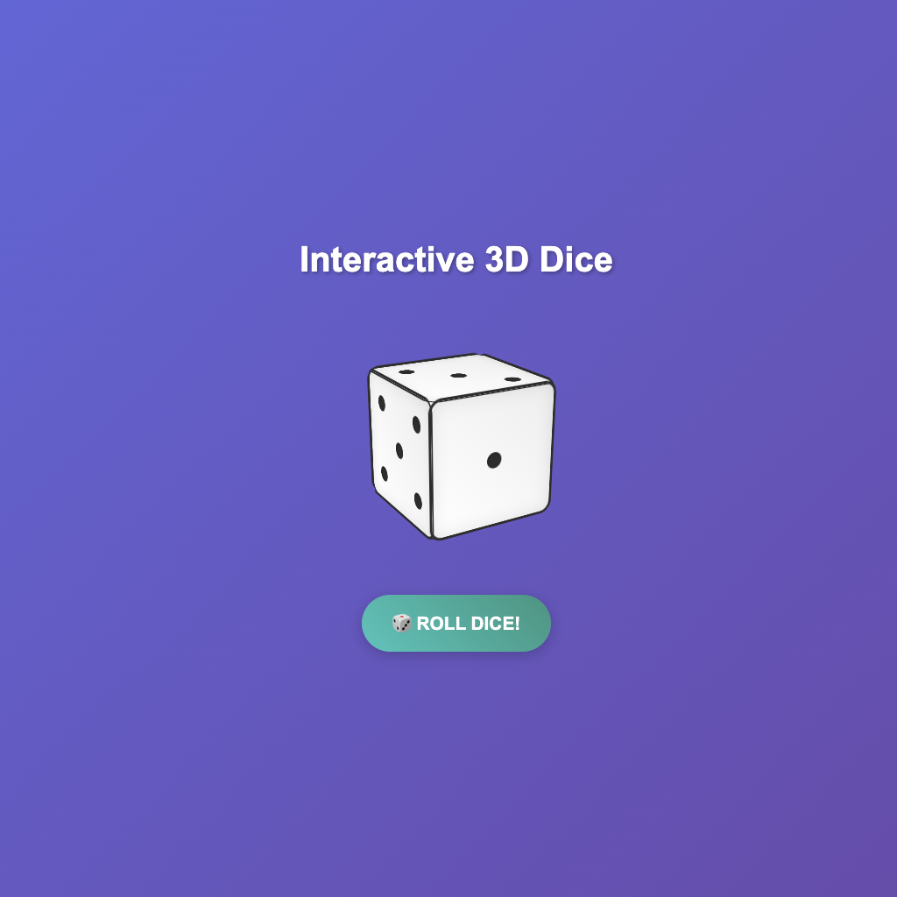

# 🎲 Interactive 3D Dice

An interactive 3D dice created with pure HTML, CSS and JavaScript. The dice can be rolled automatically or rotated manually with mouse/touch.

## ✨ Features

- **Realistic 3D dice** with all 6 faces
- **Smooth rolling animation** with realistic physics
- **Manual interaction** - drag to rotate the dice
- **Responsive design** - works on desktop and mobile
- **Modern visuals** with gradients and shadows
- **Traditional dots** on each dice face

## 🚀 How to use

1. Clone this repository
2. Open the `index.html` file in your browser
3. Click the "🎲 ROLL DICE!" button to roll automatically
4. Or drag the dice with your mouse to rotate it manually

## 🛠️ Technologies used

- **HTML5** - Project structure
- **CSS3** - Styling, animations and 3D effects
- **JavaScript** - Rolling logic and interaction

## 🤖 AI Development

This project was easily developed in just a few prompts using **Claude 4 Sonnet**, demonstrating the power of artificial intelligence to create interactive and visually appealing web applications.

## 📱 Compatibility

- ✅ Desktop (Chrome, Firefox, Safari, Edge)
- ✅ Mobile (iOS Safari, Chrome Mobile)
- ✅ Tablet

## 🎯 Features

### Automatic Rolling
- Click the button to roll the dice
- Realistic animation with multiple rotations
- Random result from 1 to 6

### Manual Control
- Drag with mouse to rotate
- Touch support for mobile devices
- Smooth rotation in all directions

## 🎨 Design

The project features a modern design with:
- Attractive background gradient
- Realistic 3D dice appearance
- Buttons with hover effects
- Smooth and responsive animations
- Clean and intuitive interface

## 📄 License

This project is open source and available under the MIT license.
